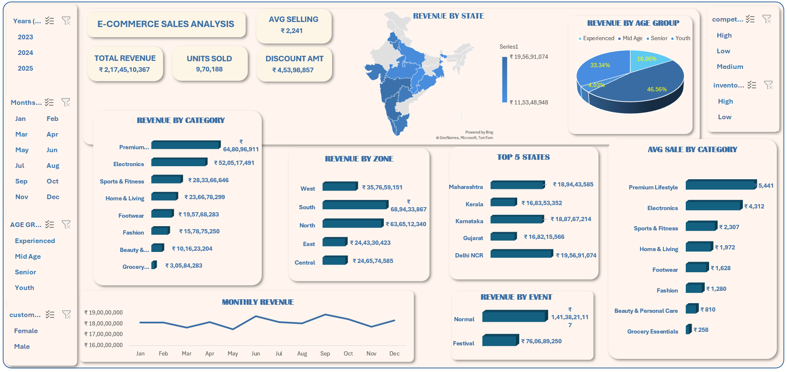

# 🛒 E-Commerce Sales Analysis Dashboard

🖼️ Dashboard Preview

  

## 📊 Description

A comprehensive dashboard analyzing e-commerce performance across India, focusing on revenue, customer demographics, and product categories.

## 🚀 Key Features
Total Revenue, Units Sold, and Discount Analysis
Revenue by Category
Revenue by State (Map Visualization)
Revenue by Age Group
Top 5 States by Revenue
Revenue by Zone (North, South, East, West, Central)
Monthly Revenue Trends
Revenue by Event (Normal vs Festival)
Average Sale by Category

## 🛠️ Tools & Skills Used
Microsoft Excel
Pivot Tables
Pivot Charts
Slicers & Filters
Data Cleaning
KPI Design
Data Analysis
Business Insights

## 📈 Key Insights
Premium and electronics categories generate the highest revenue
Sales increase during festival periods
Certain states contribute significantly to overall revenue
Customer segmentation (age group) impacts purchasing behavior

## 📁 Files Included

Ecommerce_Sales_Dashboard.xlsx

## 💡 Use Cases
Business performance tracking
Sales analysis & reporting
Dashboard design practice
